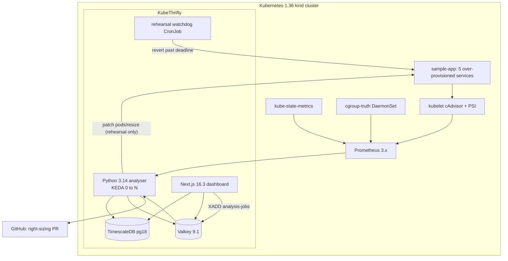

« KubeThrifty Rev 3 — Full Implementation Plan

## Verification: what already exists

The repo is **documentation only**. Two commits, zero source files, nothing compiled or deployed.

Present:
- [KubeThrifty_Implementation_Plan_Rev3.md](KubeThrifty_Implementation_Plan_Rev3.md) — 4,694-line specification (§A–§29).
- Ten skill bodies + six reference docs at the repo root as `kubethrifty-*_SKILL.md` / `kubethrifty-*_<topic>.md`.
- [.claude/skills/](.claude/skills/) — the same ten skills as `.skill` zip bundles (each contains one `<name>/SKILL.md`, byte-identical to the root copy), plus [.claude/settings.local.json](.claude/settings.local.json) (a Claude Code bash allowlist, not a rule file).
- [kubethrifty-starter.zip](kubethrifty-starter.zip) — **never extracted.** Contains a runnable Python slice: `evals/sizing.py` (Rev 3 CPU/memory asymmetry), `evals/forecaster.py` (Forecaster adapter + dependency-free `SeasonalNaive` fallback), `evals/detective/engine.py` (5 of the 8 rules), `evals/recommendation.py` (the Rev 2 CPU-only engine, kept deliberately for the before/after story), four eval gates, six 504-hour CPU fixtures, nine labelled sizing cases, a 24-case incident corpus with `digests.json`, `baseline.json`, `requirements.txt` (`numpy==2.4.4`, `pandas==3.0.2`), `pyproject.toml` (`requires-python = ">=3.14"`), and `.github/workflows/eval.yml`.

Absent: `analyser/`, `dashboard/`, `sample-app/`, `charts/`, `k8s/`, `monitoring/`, `config/`, `migrations/`, `docker-compose.yml`, `AGENTS.md`, `.cursor/`, any README.

Local toolchain: Python **3.14.6** and Node **v24.12.0** already match the mandates. **Docker, kubectl, kind and Helm are all missing** — Phase 0 has to install them, and this is a Windows host, so every cluster-facing feature runs against Linux nodes inside Docker Desktop / WSL2.

## Architecture being built

The single most important invariant across every phase: **`request = max(statistical_floor, forecast_upper, rehearsed_floor, absolute_min)`** — never `min()`. CPU is sized from P95, memory from the observed **peak** (cgroup `memory.peak`), and memory gets `limit == request`.

## Phase 0 — Project-global rules + toolchain

**Skills wiring (both layers, as chosen).** Move the root skill files into Cursor's project-skill layout so the `references/…` links inside each `SKILL.md` body resolve:
- `kubethrifty-<name>_SKILL.md` → `.cursor/skills/kubethrifty-<name>/SKILL.md` (10 files, frontmatter unchanged).
- `kubethrifty-python-analyser_sizing-rules.md` → `.cursor/skills/kubethrifty-python-analyser/references/sizing-rules.md`; same pattern for `platform-prereqs.md` (devops-k8s), `security-and-api.md` (nextjs-backend), `rehearsal-implementation.md` (resize-rehearsal), `cost-scenarios.md` (cost-and-packing), `rules-and-calibration.md` (thrift-detective).
- Do **not** add `disable-model-invocation` — the existing descriptions already carry trigger terms ("PromQL", "pods/resize", "bin packing", "Recharts"), so auto-invocation is what we want.
- Leave [.claude/skills/](.claude/skills/) untouched as the portable Claude bundles; `.cursor/skills/` becomes the editable working copy.
- Move the spec to `docs/KubeThrifty_Implementation_Plan_Rev3.md`.

**`AGENTS.md`** — always-on, short, carrying only the non-negotiables that must never be re-derived:
- Pins: K8s **1.36** demo / **1.35** floor, cgroup **v2** mandatory, containerd **2.x**, Helm **4.2.x**, KEDA **2.20**, Node **24 LTS**, Next.js **16.3.x**, React 19, Tailwind **v4** (CSS-first `@theme`), Recharts **3.x**, Python **3.14**, `timescale/timescaledb-ha:pg18.4-ts2.28.1-all`, Valkey **9.1**, `kube-prometheus-stack` ~**88.x** / Prometheus 3.x, Grafana **13.0.x**.
- Never `:latest` anywhere, `docker-compose.yml` included; CI tags by commit SHA.
- Memory is never percentile-sized; floors compose with `max()`; a modelled recommendation is never called verified (`rehearsed` > `modelled` > `partial`).
- Compare throttle **ratios**, never raw period counters; OOM via `container_oom_events_total`, never `last_terminated_reason`.
- Savings are only ever a node-count delta; per-pod waste is a percentage.
- The only mutating RBAC verb in the whole system is `patch` on `pods/resize`; the dashboard API holds no cluster credentials and has no write endpoints.
- A missing signal is `null` / "not observed", never `0`.
- Route depth to the skills by name rather than restating it.

**Toolchain.** Install Docker Desktop (WSL2 backend), `kubectl` ≥ 1.32 (needed for `--subresource resize`), `kind`, `helm` 4.2.x. Then run the [platform-prereqs](.claude/skills/) verification sequence — `stat -fc %T /sys/fs/cgroup` must print `cgroup2fs`, `/proc/pressure/cpu` must exist (add `psi=1` via `.wslconfig` `kernelCommandLine` if not), and `kubectl get --raw ".../proxy/metrics/cadvisor" | grep container_pressure` must return series. **Record the outcome:** if PSI is unavailable on WSL2, §23 degrades to throttle + OOM + restarts and every recommendation ships `evidence: partial`. That is a supported path, not a failure — but it must be decided here, not discovered in Phase 6.

## Phase 1 — Repo scaffold + starter promotion

Create the layout from §5.1: `analyser/src/`, `dashboard/`, `sample-app/{api-gateway,order-service,payment-processor,inventory-cache,notification-worker}/`, `charts/{kubethrifty,sample-app}/`, `k8s/{kind,prometheus,grafana}/`, `monitoring/`, `config/`, `migrations/`, `.github/workflows/`.

Extract the starter and promote its modules to their production homes so there is **one** implementation of each rule, with the eval harnesses importing from it:
- `evals/sizing.py` → [analyser/src/sizing.py](analyser/src/sizing.py)
- `evals/forecaster.py` → `analyser/src/forecasting/{types.py,statsforecast_forecaster.py}`
- `evals/detective/engine.py` → `analyser/src/detective/engine.py`
- harnesses + fixtures stay at `analyser/evals/` (`sizing_eval.py`, `forecast_eval.py`, `detective_eval.py`, `recommendation_eval.py`, `fixtures/`, `corpus/`, `baseline.json`)
- `evals/recommendation.py` → `analyser/evals/legacy/recommendation.py`, untouched, referenced only by its own gate

**Acceptance gate for this phase:** run all four gates before and after the move; `detective_eval.py`'s determinism digest must be **byte-identical**. If the digest moves, the refactor changed verdict content — fix the code, do not re-freeze `digests.json`.

Also in this phase: `requirements.txt` (starter pins + `httpx`, `SQLAlchemy`, `redis`, `PyGithub`, `kubernetes`, `circuitbreaker`, exact minors + lockfile), `analyser/Dockerfile` on `python:3.14-slim` non-root, `docker-compose.yml` with every tag pinned (`prom/prometheus:v3.x.y`, `grafana/grafana:13.0.x`, `valkey/valkey:9-alpine`), and `config/instances.json` with `as_of: "2026-08-01"`, region `ap-south-1`, the five instance types and the `self_managed_karpenter` / `eks_auto_mode` (`surcharge_pct: 12.0`) scenarios.

## Phase 2 — Cluster, sample app, observability (Week 1)

- `k8s/kind/cluster.yaml`: 1 control-plane + 2 workers on `kindest/node:v1.36.x`, `featureGates.InPlacePodLevelResourcesVerticalScaling: true`, and **no** explicit `InPlacePodVerticalScaling` / `KubeletPSI` (both GA on 1.36 — setting them emits a warning).
- Five sample services with synthetic load generators matching §3's patterns (steady, bursty, CPU-heavy, memory-heavy, nearly idle), requesting 5.5 CPU / 6.5 GB against a ~1.7 CPU / 2.6 GB real peak. This over-provisioning is the demo — do not "fix" it.
- `kube-prometheus-stack` from the pinned OCI chart with `k8s/prometheus/kube-prometheus-stack-values.yaml`: `kubelet.serviceMonitor.cAdvisor: true`, `honorLabels: true`, `scrapeInterval: 15s`, `retention: 14d`.
- Exit criterion: `container_cpu_usage_seconds_total`, `container_memory_working_set_bytes`, `kube_pod_container_resource_requests`, `container_cpu_cfs_periods_total`, `container_oom_events_total` all populated; `container_pressure_*` populated **or** the partial-evidence path formally recorded.

## Phase 3 — Analyser core (Week 2)

- `prometheus_client.py` (httpx, timeout + retry with full jitter + `@circuit`), `metric_collector.py`, `config.py`.
- Wire the promoted `sizing.py` into `recommendation_engine.py`: keep §5.2's `ResourceRecommendation` dataclass and the `Confidence` / `Action` enums, import all sizing maths. Constants are fixed: `CPU_REQUEST_MARGIN 1.20`, `CPU_LIMIT_MARGIN 1.50`, `MEM_REQUEST_MARGIN 1.25`, `MEM_HEADROOM_FOR_GC 1.10`, `MIN_CPU_MILLICORES 50`, `MIN_MEMORY_MIB 64`, `MIN_DATA_POINTS 168`, `MIN_SAVINGS_THRESHOLD 0.10`.
- `forecasting/` wired as the predictive floor with `MIN_POINTS = 24 * 14`; `confident=False` falls back to the trailing statistical floor.
- `verification/signals.py`: the `Window` dataclass with the `throttle_ratio` property and `evaluate(before, after, slo_burn_rate=None)` — `THROTTLE_RATIO_DELTA 0.05`, `THROTTLE_RATIO_FLOOR 0.02`, `RESTART_TOLERANCE 0`, `PSI_FULL_CEILING 0.05`. One implementation serves post-merge verification **and** the rehearsal.
- `cloud_pricing/` as a `PricingStrategy` Strategy hierarchy; `manifest_generator.py` via a fluent `ManifestBuilder`; `github_pr_creator.py` on PyGithub, branch `kubethrifty/right-size-{YYYYMMDD-HHMM}`, opens PRs only — never merges, never touches `main`.
- CLI: `python -m src.main --window 7d --auto-pr`.

## Phase 4 — Data layer (Week 3)

- `migrations/001_core.sql`: `clusters`, `analysis_runs`, `recommendations`, and `metric_snapshots` as a hypertable (`chunk_time_interval => INTERVAL '1 day'`) with the `hourly_pod_stats` continuous aggregate using `percentile_agg` / `approx_percentile`, plus the compression and 30-day retention policies. Verify the Toolkit is present — the `-ha` image is what makes those functions exist.
- `migrations/003_rev3_evidence.sql`: `psi_samples` hypertable (including `memory_peak`, `oom_kill_total`, `throttled_periods`, `cfs_periods`, `source`), the `rehearsal_outcome` enum, `rehearsals`, `verdicts`, and the `recommendations` additions `binding_constraint`, `sizing_basis`, `evidence_tier`, `rehearsal_id`, `hpa_coupled`.
- Valkey: cache-aside keys (`dashboard:recs:{clusterId}` 6h, `pod:metrics:{pod}:{window}` 15m, `promql:{hash}` 5m), the `analysis-jobs` stream with consumer group `analysers`, `analysis-jobs-dlq`, and the `analysis:lock:{cluster}` `SET NX` concurrency lock.

## Phase 5 — Dashboard (Week 4)

- Backend Route Handlers under `dashboard/app/api/**`, each `runtime = 'nodejs'`, thin: Zod-validate → `lib/**` service → `NextResponse`. Routes: `recommendations`, `pods/:name/metrics`, `pods/:name/pressure`, `rehearsals[/:id]`, `verdicts[/:bundleSha]`, `savings/{summary,scenarios}`, `analysis/{trigger,history,:id}`, `health`. Errors through one RFC 9457 `problem()` helper. Prometheus reached only via a server-side proxy with the `ALLOWED_METRICS` allow-list, label matchers bound (never concatenated), `step ≥ 30s`, `window ≤ 30d`, 8s timeout, `opossum` breaker. `POST /api/analysis/trigger` does `XADD` and returns `202 { runId }`; it is the only write in the API and it does not touch the cluster.
- Frontend: App Router only, Server-Components-first, Tailwind v4 `@theme` tokens in `app/globals.css` (three families — waste, pressure in a different hue, evidence), shadcn/ui and Tremor blocks **copied into** `components/ui/` (no `@tremor/react`), Recharts 3.x charts as `'use client'` + `dynamic(..., { ssr: false })` with `connectNulls={false}`.
- Non-negotiable UI behaviours: an `EvidenceBadge` on every recommendation card and row; a `null` signal renders as "not observed", never `0` and never green; the pod chart carries the peak (memory) or P95 (CPU) reference line labelled "sizing basis" and the 0.05 regression threshold line; the landing page is a **waste × pressure quadrant**, not a single-axis heatmap; there are no resize or rollback buttons anywhere — only PR links.

## Phase 6 — Evidence layer: PSI + cgroup truth (Week 5)

- `collector/cgroup_truth.py`: read-only walk of `CGROUP_ROOT` (default `/host/sys/fs/cgroup`), parsing `memory.peak`, `memory.max` (`"max"` → `None`, never `0`), `memory.events` `oom_kill`, `cpu.stat`, `cpu.pressure` / `memory.pressure`. Exports `kubethrifty_cgroup_memory_peak_bytes`, `kubethrifty_cgroup_oom_kill_total`, `kubethrifty_cgroup_throttle_ratio`, plus a scrape-health metric so a silent collector can never read as "no pressure".
- `charts/kubethrifty/templates/daemonset-cgroup-truth.yaml`: port 9847, `--interval=30s`, `runAsUser: 65534`, `readOnlyRootFilesystem: true`, all capabilities dropped, `automountServiceAccountToken: false`, requests `10m/32Mi` limits `100m/64Mi`, plus a `PodMonitor`.
- `analyser/src/scoring.py`: `headroom_index(...)` — hard zero on any OOM event or fewer than 168 samples.
- Feed `memory.peak` into `size_memory` as the sizing basis and stamp the evidence tier. Gate: `sizing_eval.py` must keep `low_util_high_pressure` at no-reduction and `spiky_peak_gt_p95` at request ≥ peak.

## Phase 7 — Resize Rehearsal (Week 6) — the headline

- `analyser/src/rehearsal/preflight.py`: refuse unless rehearsals are globally enabled, the namespace is not `kubethrifty.io/tier: critical`, the workload is not annotated `kubethrifty.io/rehearsal: disabled`, `replicas >= 2`, no rollout in flight, the PDB tolerates one disruption, no VPA in `Auto`, and the per-cluster concurrency cap (default 3) is free. On refusal the recommendation still ships — as `modelled`, with the reason stated.
- `analyser/src/rehearsal/runner.py`: the compensation-first saga. Persist `original_requests`/`original_limits` and `revert_deadline = now + observe + resize_timeout + 600` **before** touching the cluster; then baseline 300s → PATCH `/api/v1/namespaces/{ns}/pods/{name}/resize` via the generic `call_api` (the Python client has no typed method) → poll `status.containerStatuses[*].resources` every 5s until actual matches candidate (a 200 from the PATCH proves nothing) → observe 1800s → `evaluate()` → **revert in `finally`, unconditionally**. `Infeasible` or timeout is `inconclusive`, never `safe`. Any restart forces `regressed`. Pod UID mismatch means the pod was rescheduled: `inconclusive`, no revert.
- `analyser/src/rehearsal/watchdog.py` as a **separate CronJob** on `*/2 * * * *`, sweeping `revert_deadline < now()`, closing as `reverted_by_watchdog`, exporting `kubethrifty_rehearsals_watchdog_reverts_total` — a non-zero value pages.
- `charts/kubethrifty/templates/rbac-rehearsal.yaml`: reads on pods/deployments/statefulsets/PDBs/HPAs, `get,create,update` on leases, and `patch` on `pods/resize` as the **only** mutating verb.
- Rank candidates by `projected_node_savings × confidence` and rehearse the top 3 per run; a `safe` outcome becomes the `rehearsed` floor and its evidence table goes into the PR body with the bundle sha and `thriftctl replay` line.

## Phase 8 — Coupling, savings, Helm 4, CI/CD (Week 7)

- `coupling/detect.py` (HPAs owned by a `ScaledObject` report as `keda`; external-metric HPAs are not coupled), `coupling/simulate.py` returning `safe` | `co_change_target` | `refuse` with 0.10 hysteresis, `coupling/qos.py` blocking Guaranteed → Burstable unless `kubethrifty.io/allow-qos-demotion=true`. A resource change and its HPA target change ship in **one** PR — the intermediate state is the outage.
- `packing/binpack.py`: FFD against `allocatable()` (`cpu_reserved = min(cpu*0.06, 400)`, `mem_reserved = min(mem*0.10, 4096) + 100`), DaemonSets seeded onto every new node first, `max_pods` enforced per instance type, 730 hours/month, `savings_report()` producing the `nodes_removed` headline. This node delta — never per-pod millicores — is the only rupee figure the product prints.
- Helm chart completed (dashboard 2 replicas + HPA + PDB, analyser at `minReplicaCount: 0` behind a KEDA `redis-streams` `ScaledObject` on `analysis-jobs`/`analysers`, enqueuer CronJob every 6h, TimescaleDB StatefulSet, Valkey, watchdog CronJob, DaemonSet, ingress, secrets). Helm 4 migration: add the `watch` verb for kstatus `--wait`, and convert any post-renderer to a plugin.
- Workflows: `ci.yml` (lint, test, **all four eval gates**), `deploy.yml` (SHA tags, cosign keyless signing, `helm upgrade --install`), `analysis.yml` (6-hourly), `policy.yml` (shift-left waste gate + the CI grep guard that fails on any unpinned image).
- Self-referential demo: KubeThrifty right-sizes its own pods and opens a PR against its own `values.yaml`.

## Phase 9 — ThriftDetective, docs, demo (Week 8)

- Grow `detective/engine.py` from the starter's 5 rules to all 8 by adding `NODE_PRESSURE_EVICTION`, `QOS_DEMOTION_EVICTION` and `STARTUP_STARVATION`. `NODE_PRESSURE_EVICTION` is the rule the starter's `thumbnailer__noisy_neighbour` misfire is explicitly asking for — adding it should move accuracy up. `investigate(bundle)` stays pure: no network, no clock, no randomness, no LLM in the decision path.
- Extend `corpus/generate.py` with the matching generators, keep ≥ 3 red herrings and the two deliberate misfires, then re-run the gate: accuracy ≥ 0.90, Brier ≤ 0.08, ECE ≤ 0.10. **Only re-freeze `digests.json` after reading Brier and ECE, and say why in the commit message.**
- `detective/narrative.py` with `TemplateNarrator` as the default; `LLMNarrator` optional, off by default, its output discarded if it names a rule absent from the verdict list.
- `thriftctl replay <sha256>` (offline), the `kubectl-thrift` plugin, then the README (architecture diagram, "why not VPA / KRR / Goldilocks", pinned-version badges, quick start, the self-referential demo), the rehearsal GIF, and the 2-minute video.

## Deliberately not built

§27 (DRA / GPU / agent-density) stays slide-and-guardrail only, per §28 Tier 4 — plus multi-cluster, the Slack bot, and a full OPA suite. The §28 rule holds: if it is not demoable in the five-minute script, it belongs in the README roadmap, not the repo.

## Risks to settle early

- **PSI on WSL2** is the biggest one. Phase 0 either confirms `container_pressure_*` flows or commits the project to the `partial` evidence tier — and Phase 7's verdicts get weaker without it, since throttle and OOM alone cannot distinguish "ran hot and was fine" from "ran hot and stalled".
- **`kindest/node:v1.36.x` availability.** The spec was written 17 Aug 2026; verify the tag actually exists before pinning, and confirm the node image ships containerd 2.x (PSI is absent from the 1.7 line).
- **`statsforecast` on Python 3.14.** The starter already ships green without it via `SeasonalNaive`. If the wheel does not resolve, stay on the fallback and record the reason in an ADR rather than downgrading Python.
- **Digest churn.** Any refactor that touches the detective engine risks silently changing verdict bytes. Treat the determinism digest as a build-breaking test throughout, not just in Phase 9.