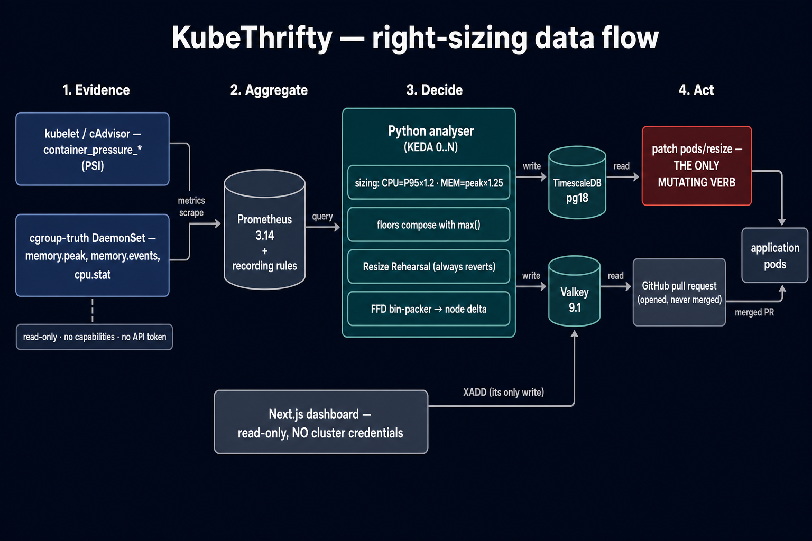
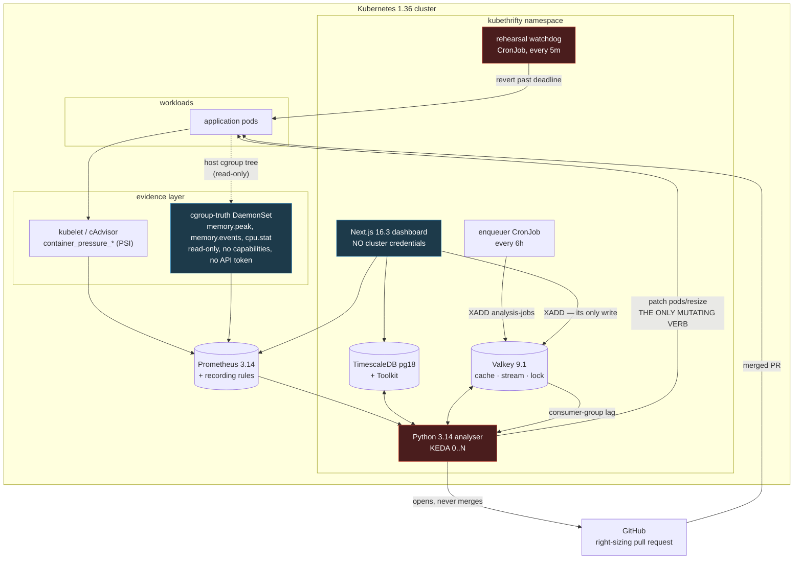

# KubeThrifty

A Kubernetes pod right-sizing advisor that measures **suffering**, not just usage — and proves its
recommendations on a live pod before proposing them.

Most right-sizers compute a percentile and send a pull request. That produces two failure modes they
cannot see:

- **Memory sized from a percentile.** A P95 discards the top 5% of samples. Those samples are the
  allocation spikes that OOMKill a container.
- **A "saving" that costs money.** Shrink a request that an HPA scales on, and measured utilisation
  rises for the same real load — so the autoscaler adds a replica. Trimming 380m per replica and then
  adding a whole replica is a net loss that every per-pod waste metric reports as a success.

KubeThrifty is built around avoiding both.

---

## The five things that make it different

### 1. CPU and memory are sized by different rules

This is the most important design decision in the project.

| | CPU | Memory |
| --- | --- | --- |
| Basis | P95 percentile | **observed peak** (cgroup `memory.peak`) |
| Request | P95 × 1.20 | peak × 1.25 (+1.10 GC headroom for JVM/Node/dotnet) |
| Limit | P99 × 1.50 (generous) | **`limit == request`** |
| Over-limit means | CFS throttling — slow, survivable | **OOMKill — fatal** |

Because the consequences are asymmetric, the maths is asymmetric. Memory is **never**
percentile-sized.

Measured on the demo cluster, this is not a theoretical distinction:

```text
prometheus/prometheus   memory   1024 Mi requested
  sized from a sampled working-set gauge  ->  344 Mi
  sized from the kernel high-water mark   ->  507 Mi
```

The 15-second sampled gauge under-reported the true peak by **47%**. Sizing from it would have set a
limit well below real demand.

### 2. Floors compose with `max()`, never `min()`

```python
request = max(statistical_floor, forecast_upper, rehearsed_floor, absolute_min)
```

Every clever input is a **floor** that can only ever *raise* a request. A forecast predicting lower
demand does not shrink anything — it simply stops being the binding constraint. Which floor won is
recorded as `binding_constraint` on every recommendation, so a number can always be explained.

### 3. Resize Rehearsal — evidence instead of a prediction

Before proposing a reduction, KubeThrifty applies it to **one live pod, in place, with zero
restarts**, watches the kernel pressure signals, and then **always reverts**.

The ordering is the safety property:

1. The **compensation row** — original requests, original limits, revert deadline — is persisted
   **before the cluster is touched**. If the process dies one millisecond after the resize, that row
   is the only thing that knows how to undo it.
2. Baseline captured, resize applied via `patch pods/resize`, outcome observed.
3. **Revert runs in a `finally`** — on success, on regression, on exception.
4. A separate **watchdog CronJob** sweeps anything past its deadline, because a watchdog living
   inside the process it guards dies with it.

A timed-out or `Infeasible` resize is `inconclusive`, never `safe`: absence of observed regression is
not evidence of safety when the change never took effect.

### 4. Savings are a node-count delta

```text
savings = (nodes_before − nodes_after) × node_price
```

This is the **only** figure in the product that carries a currency symbol. Clouds bill per node, so
reclaiming 400m spread across thirty pods saves exactly nothing until a node disappears. Per-pod
waste is reported as a **ratio**, always.

When no node becomes removable, the answer is `0.00` with a reason — not a fabricated per-pod total:

```text
nodes: 3 -> 2 (m7i.large, cpu-bound)
monthly saving: 73.58 USD (1 node removed, prices as of 2026-08-01)
```

### 5. Every recommendation carries an evidence tier

| Tier | Meaning |
| --- | --- |
| `rehearsed` | Ran on a live pod, nothing regressed, reverted |
| `modelled` | Percentiles plus a forecast. Sound, but **not tried** |
| `partial` | A signal the sizer wanted was unavailable — the safety checks ran on less than they were designed for |

A modelled recommendation is never described as verified. **A missing signal is `null` / "not
observed" — never `0`, never green, never "no pressure".** An empty PSI series downgrades the tier; it
never raises confidence.

---

## Architecture



The authoritative version, including the exact edges:



### The mutating surface, in full

```yaml
- apiGroups: [""]
  resources: ["pods/resize"]   # a SUBRESOURCE: this does not confer patch on pods
  verbs: ["patch"]
```

That is the entire write surface of the system. Notably absent:

- No `delete` on pods — KubeThrifty **cannot** restart a workload, which is what makes "zero
  restarts" structural rather than a promise.
- No write on Deployments or StatefulSets — durable right-sizing reaches a cluster **only** through a
  merged Git PR.
- No `secrets`, not even read.
- No `pods/exec`, no `eviction`, no `nodes` write.

The dashboard holds **no cluster credentials at all**. It cannot resize a pod because it has no
mechanism to try. Its single write in the entire system is an `XADD` onto the job stream.

---

## Quick start

Requires Docker with the WSL2 backend (on Windows), `kubectl` ≥ 1.32, `kind`, and Helm 4.2.x.

```bash
# 1. Verify the host can actually provide the evidence layer.
make preflight          # cgroup2fs + /proc/pressure must both be present

# 2. Local data layer and one analysis pass — no cluster needed.
make stack-up           # TimescaleDB + Valkey + Prometheus + Grafana, all pinned
make verify-data        # asserts the Toolkit round trip and every safety CHECK constraint
make test               # lint + 184 unit tests + all four eval gates

# 3. The full demo cluster.
make demo-up            # kind 1.36, kube-prometheus-stack, 5 over-provisioned services
make platform           # the cgroup-truth collector and its recording rules
make verify-metrics      # every required metric family must be populated

# 4. Analyse.
make analyse            # or: cd analyser && python -m src.main --window 7d
make demo-self          # KubeThrifty right-sizes its OWN pods
```

> On Windows, `docker compose` binds PostgreSQL to host port **5433** rather than 5432, because a
> native PostgreSQL install commonly owns 5432 — and connecting to the wrong database succeeds, which
> fails far later and far more confusingly than a refused connection. Override with `KT_DB_PORT`.

---

## The four CI gates

Every build is gated. None of them can be ignored, because a gate that can be ignored is
documentation.

| Gate | Asserts | Current |
| --- | --- | --- |
| **Sizing decisions** | Categorical assertions — *did it choose to reduce?*, *was the binding constraint the peak margin?* — never float comparisons | 9/9 |
| **Forecast accuracy** | sMAPE **and** 90% interval coverage against `baseline.json` | pass |
| **Detective accuracy + calibration** | top-1 ≥ 0.90, Brier ≤ 0.08, ECE ≤ 0.10 | 0.914 / 0.0676 / 0.0603 |
| **Determinism digest** | sha256 of every verdict over the whole corpus | byte-identical |

Sizing is graded on **decisions**, not numbers: a float-tolerance test passes while the decision
silently inverts.

Calibration is gated separately from accuracy because a detective that is right 92% of the time while
claiming 99% confidence is miscalibrated, and its confidence figure is then actively misleading. Run
`python -m evals.reliability` for the reliability diagram behind the ECE number — it shows the
*direction* of the error, which is what tells you whether the fix is a rule change or a corpus gap.

Plus four policy guards (`make policy`) that fail a pull request on: any floating image tag, any
mutating RBAC verb beyond `patch pods/resize`, any coercion of a missing signal to `0`, and any
newly-introduced over-provisioned workload.

---

## ThriftDetective

A deterministic, change-attributed incident investigator. `investigate(bundle)` is **pure** — no
network, no clock, no randomness, no LLM in the decision path — so any verdict can be reproduced
offline, months later, from the evidence bundle alone:

```bash
python -m src.detective.thriftctl replay incident.json --evidence
python -m src.detective.thriftctl verify incident.json --runs 50
```

Eight resource-shaped failure modes. The three added in ruleset 1.1.0 exist to separate *"this
container's own limit hurt it"* from *"it was collateral damage"* — a distinction with **opposite**
remediations:

| Rule | Says |
| --- | --- |
| `MEM_LIMIT_TOO_LOW` | OOMKilled; the limit is below real demand → **raise it** |
| `MEM_PRESSURE_NO_KILL` | Thrashing reclaim without dying. Invisible to percentile-only tools |
| `CPU_LIMIT_TOO_LOW` | Throttled and stalling |
| `HPA_COUPLING_STORM` | Replicas grew after a cut — the autoscaler reacted to our change, not to load |
| `RESIZE_INFEASIBLE_STUCK` | An in-place resize can never be satisfied on this node |
| `NODE_PRESSURE_EVICTION` | The **node** ran out; this container used 12% of its own limit → **do not raise it** |
| `QOS_DEMOTION_EVICTION` | Our change moved it down the eviction order, and then it was evicted |
| `STARTUP_CPU_STARVATION` | Steady-state sizing starved the startup phase — fix the probe, not the request |

The differentiator is attribution: every verdict tries to name **KubeThrifty's own merged PR** that
caused the incident. No external investigator can do that, because none of them owns the change log.

Anything outside scope returns `NO_VERDICT` with an explicit scope statement. Eight of the 35 corpus
cases are red herrings the engine is **required** to refuse — a tool that never says "I don't know"
cannot be trusted when it does say something.

---

## Seeing the rehearsal

```bash
make demo-rehearsal     # narrated walkthrough, simulated and deterministic
make demo-record        # the same, paced for screen recording
```

This is a **script rather than a recording**, deliberately. A recording rots: it cannot be re-run,
cannot be diffed, and cannot fail when the behaviour it depicts changes. The script can, and it
asserts the invariant it is demonstrating — so it is simultaneously the walkthrough and a test.

It runs three scenarios (safe, regressed, `Infeasible`) and shows that **all three revert the pod to
its original size**, while only the safe one contributes a sizing floor.

> A rendered GIF/video of this walkthrough is a manual capture step; run `make demo-record` and
> record the terminal. It is deliberately not committed, because a checked-in recording is the one
> artifact in this repository that CI could never verify.

## Repository layout

```text
analyser/            Python 3.14 — the statistical core
  src/sizing.py        CPU/memory asymmetry. Graded by sizing_eval
  src/collector/       cgroup v2 truth: memory.peak, PSI, the headroom index
  src/rehearsal/       preflight gates, compensation-first runner, watchdog
  src/coupling/        HPA-collision guard: safe | co_change_target | refuse
  src/packing/         FFD bin-packer — the only source of a currency figure
  src/detective/       the pure rule engine + thriftctl replay
  evals/               the four CI gates and the labelled corpus
dashboard/           Next.js 16.3 App Router, TypeScript strict — read-only
charts/kubethrifty/  Helm 4 chart: KEDA scale-to-zero, DaemonSet, CronJobs, RBAC
migrations/          TimescaleDB schema: hypertables, continuous aggregate, evidence tables
config/instances.json  Pinned prices with an `as_of` date and region
```

## Version pins

Kubernetes **1.36** demo / **1.35** floor · cgroup **v2** mandatory · containerd **2.x** ·
Helm **4.2.4** · KEDA **2.20** · Node **24 LTS** · Next.js **16.3.2** · React **19.2.8** ·
Tailwind **v4** (CSS-first `@theme`, no `tailwind.config.js`) · Recharts **3.10.1** · Python **3.14**

Every image is pinned to an exact patch. `:latest` appears nowhere, `docker-compose.yml` included —
a right-sizing tool whose own dependencies drift has no standing to lecture anyone about pinning. CI
greps for it and fails the build.

## Documentation

- [`AGENTS.md`](AGENTS.md) — the non-negotiable project rules
- [`docs/adr/0001-psi-evidence-tier-on-wsl2.md`](docs/adr/0001-psi-evidence-tier-on-wsl2.md) — why
  this project runs on the full evidence tier, and the host changes required to get there
- [`.cursor/skills/`](.cursor/skills/) — ten domain skills covering sizing, the evidence layer,
  rehearsals, cost modelling, and the detective
